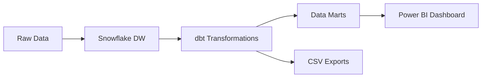

# Oklahoma Tax Credit Insights 📊

A comprehensive end-to-end analytics pipeline for ingesting, modeling, and visualizing Oklahoma tax credit data using modern data stack technologies: **Snowflake**, **dbt**, and **Power BI**.


---

## Project Overview

This project transforms raw Oklahoma tax credit data into actionable business insights through a modern data pipeline. The solution provides stakeholders with interactive dashboards to analyze credit distributions, trends, and utilization patterns across different industries and recipients.

### Key Features
- **Automated Data Pipeline**: Seamless data ingestion and transformation
- **Interactive Dashboards**: Rich visualizations with drill-through capabilities  
- **Data Quality Assurance**: Comprehensive testing and validation
- **Scalable Architecture**: Built for enterprise-grade analytics

---

## Architecture



**Data Flow:**
1. Raw tax credit data ingested into Snowflake
2. dbt models clean and transform the data
3. Analytical marts created for specific business questions
4. Power BI connects to marts for visualization
5. Optional CSV exports for offline analysis

---

## 📁 Repository Structure

```
oklahoma-tax-credit-insights/
├── 📄 .env                              # Snowflake credentials (git-ignored)
├── 📄 .gitattributes                    # Git line-ending configuration
├── 📄 .gitignore                        # Git ignore patterns
├── 📄 dbt_project.yml                   # dbt project configuration
├── 📄 export_mart_tables.py             # Python utility for CSV exports
├── 📄 requirements.txt                  # Python dependencies
├── 📄 profiles.yml.example              # dbt profile template
├── 📄 oklahoma-tax-credit-insights.pbix # Power BI dashboard file
├── 📂 models/                           # dbt transformation models
│   ├── 📂 staging/                      # Data cleaning and standardization
│   │   ├── 📄 sources.yml               # Source table definitions
│   │   ├── 📄 schema.yml                # Column descriptions and tests
│   │   └── 📄 stg_tax_credits.sql       # Staging transformation logic
│   └── 📂 marts/                        # Business-focused analytical views
│       ├── 📄 mart_credit_distribution.sql    # Credit amount bucketing
│       ├── 📄 mart_credit_summary.sql         # Fiscal year summaries
│       ├── 📄 mart_credit_trends.sql          # Year-over-year trends
│       ├── 📄 mart_credit_utilization_rate.sql # Recipient utilization %
│       ├── 📄 mart_credits_by_industry.sql    # Industry-based analysis
│       └── 📄 mart_top_recipients.sql         # Top 10 credit recipients
├── 📂 powerbi/                          # Power BI assets
│   └── 📄 OK_Tax_Credit_Insights.pbix   # Interactive dashboard
├── 📂 reports/                          # Generated reports
│   └── 📄 stakeholder_report.pdf        # Executive summary
└── 📂 docs/                             # Project documentation
    ├── 📄 SETUP.md                      # Detailed setup instructions
    ├── 📄 DATA_DICTIONARY.md            # Field definitions
    └── 📄 TROUBLESHOOTING.md            # Common issues and solutions
```

---

## Quick Start

### Prerequisites
- **Snowflake Account**: With `COMPUTE_WH` warehouse access
- **dbt Core**: Version 1.x or higher
- **Python**: Version 3.8 or higher
- **Power BI Desktop**: For dashboard visualization (Windows only)

### Installation Steps

1. **Clone the repository**
   ```bash
   git clone https://github.com/Willthompson99/oklahoma-tax-credit-insights.git
   cd oklahoma-tax-credit-insights
   ```

2. **Set up Python environment**
   ```bash
   # Create virtual environment (recommended)
   python -m venv venv
   source venv/bin/activate  # On Windows: venv\Scripts\activate
   
   # Install dependencies
   pip install -r requirements.txt
   ```

3. **Configure Snowflake credentials**
   ```bash
   # Copy and edit the dbt profile
   cp profiles.yml.example ~/.dbt/profiles.yml
   
   # Create environment file
   cp .env.example .env
   # Edit .env with your Snowflake credentials
   ```

4. **Build the data pipeline**
   ```bash
   # Install dbt dependencies
   dbt deps
   
   # Run transformations
   dbt run
   
   # Execute data tests
   dbt test
   
   # Generate documentation
   dbt docs generate
   dbt docs serve
   ```

5. **Launch Power BI Dashboard**
   - Open `powerbi/OK_Tax_Credit_Insights.pbix`
   - Refresh data connections
   - Explore interactive visualizations

---

## Dashboard Features

### Key Performance Indicators
| Metric | Description |
|--------|-------------|
| **Total Claims** | Total number of tax credit claims processed |
| **Average Credit Amount** | Mean value of individual credits |
| **Total Credit Amount** | Sum of all credits awarded |

### Interactive Visualizations
- **📊 Utilization Rate by Recipient**: Horizontal bar chart showing percentage breakdown
- **🏭 Credits by Industry**: Bar chart displaying total amounts by credit type
- **📈 Trends Over Time**: Line chart tracking amounts and claims by tax year
- **🔍 Detailed Records**: Drill-through table with comprehensive credit details

### Filter Controls
- **Credit Type**: Filter by specific credit categories
- **Fiscal Year**: Analyze data for specific time periods
- **Recipient**: Focus on particular organizations

---

## Data Models

### Staging Layer
- **`stg_tax_credits`**: Cleaned and standardized raw data with data type conversions

### Mart Layer
- **`mart_credit_distribution`**: Credits grouped by amount ranges
- **`mart_credit_summary`**: Fiscal year aggregations
- **`mart_credit_trends`**: Year-over-year trend analysis
- **`mart_credit_utilization_rate`**: Recipient utilization percentages
- **`mart_credits_by_industry`**: Industry-based credit analysis
- **`mart_top_recipients`**: Top 10 credit recipients by total amount

---

## Advanced Usage

### Export Data to CSV
```bash
python export_mart_tables.py
```
This creates timestamped CSV exports in `data/marts_exports/` for offline analysis.

### Run Specific Models
```bash
# Run only marts
dbt run --select marts

# Run with full refresh
dbt run --full-refresh

# Test specific model
dbt test --select mart_credit_summary
```

### Custom Analysis
Extend the pipeline by adding new models in the `models/marts/` directory following the existing patterns.

---

## Contributing

We welcome contributions to improve this project! Please follow these steps:

1. **Fork the repository**
2. **Create a feature branch**
   ```bash
   git checkout -b feature/amazing-feature
   ```
3. **Make your changes**
4. **Add tests** for new functionality
5. **Commit your changes**
   ```bash
   git commit -m "Add amazing feature"
   ```
6. **Push to your branch**
   ```bash
   git push origin feature/amazing-feature
   ```
7. **Open a Pull Request**

### Development Guidelines
- Follow existing code style and patterns
- Add appropriate documentation for new features
- Ensure all tests pass before submitting
- Update the README if needed

---

## Performance Optimization

### dbt Best Practices
- Models are configured as views for flexibility
- Appropriate indexing strategies implemented
- Incremental models for large datasets (future enhancement)

### Snowflake Optimization
- Efficient warehouse sizing
- Query result caching enabled
- Clustered tables for large datasets

---

## Troubleshooting

### Common Issues

**Connection Errors**
- Verify Snowflake credentials in `.env` file
- Check network connectivity and firewall settings
- Ensure warehouse is running and accessible

**dbt Compilation Errors**
- Run `dbt deps` to install dependencies
- Check SQL syntax in model files
- Verify source table exists and is accessible

**Power BI Refresh Issues**
- Confirm Snowflake connector is installed
- Check data source credentials
- Verify mart tables exist in Snowflake

For detailed troubleshooting, see `docs/TROUBLESHOOTING.md`.

---

## Future Enhancements

### Planned Features
- [ ] **Automated Data Quality Monitoring**: Great Expectations integration
- [ ] **Real-time Data Streaming**: Kafka/Kinesis integration
- [ ] **Advanced ML Analytics**: Anomaly detection and forecasting
- [ ] **API Development**: REST API for programmatic access
- [ ] **Alerting System**: Automated notifications for key metrics
- [ ] **Multi-tenant Support**: Support for multiple state datasets

### Technical Improvements
- [ ] **CI/CD Pipeline**: GitHub Actions for automated testing
- [ ] **Docker Containerization**: Simplified deployment
- [ ] **Cloud Deployment**: AWS/Azure infrastructure as code
- [ ] **Data Lineage**: Enhanced documentation and tracking

---

## License

This project is licensed under the MIT License - see the [LICENSE](LICENSE) file for details.

---

## Acknowledgments

- **Oklahoma Tax Commission** for providing the tax credit data
- **dbt Community** for excellent documentation and support
- **Snowflake** for robust data warehousing capabilities
- **Microsoft Power BI** for powerful visualization tools

---

## Support

For questions, issues, or feature requests:
- 📧 Email: [will.thompson@example.com](mailto:will.thompson@example.com)
- 🐙 GitHub Issues: [Create an issue](https://github.com/Willthompson99/oklahoma-tax-credit-insights/issues)
- 💬 Discussions: [Join the conversation](https://github.com/Willthompson99/oklahoma-tax-credit-insights/discussions)

---

<div align="center">
  <strong>Built with ❤️ for data-driven insights</strong>
</div>