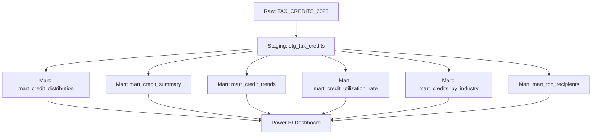

# Data Dictionary

This document provides comprehensive definitions for all data fields, transformations, and business logic used in the Oklahoma Tax Credit Insights project.

## Source Data

### Raw Table: `TAX_CREDITS_2023`

| Field Name | Data Type | Description | Example Values | Notes |
|------------|-----------|-------------|----------------|-------|
| `FISCAL_YEAR` | VARCHAR(10) | Oklahoma fiscal year identifier | "FY23", "FY24", "FY25" | Oklahoma FY runs July 1 - June 30 |
| `TAX_YEAR` | INTEGER | Calendar year for tax credit | 2023, 2024, 2025 | Standard calendar year |
| `RECIPIENT_NAME` | VARCHAR(255) | Name of organization receiving credit | "ABC Corporation", "XYZ Industries" | May include individuals or entities |
| `CREDIT_TYPE` | VARCHAR(100) | Category/type of tax credit | "Economic Development", "Historic Preservation" | Standardized credit categories |
| `AMOUNT` | VARCHAR(50) | Credit amount as string | "$1,234,567.89", "500000" | Contains commas and dollar signs |
| `CREDIT_DESCRIPTION` | TEXT | Detailed description of credit | "Qualified investment in manufacturing equipment" | Free-form text field |

### Data Quality Issues in Source
- **Amount Field**: Contains formatting inconsistencies (commas, dollar signs, empty values)
- **Missing Values**: Some records may have null or empty amounts
- **Text Variations**: Credit types and descriptions may have slight variations

## Staging Layer

### `stg_tax_credits`
Cleaned and standardized version of the raw data with consistent formatting and data types.

#### Transformations Applied
1. **Amount Cleaning**: Remove commas, convert to decimal(15,2)
2. **Null Handling**: Convert null/empty amounts to 0
3. **Data Type Conversion**: Ensure proper data types for all fields
4. **Field Standardization**: Consistent naming and formatting

#### Output Schema
| Field Name | Data Type | Description | Business Logic |
|------------|-----------|-------------|----------------|
| `fiscal_year` | VARCHAR | Fiscal year identifier | Cast to VARCHAR for consistency |
| `tax_year` | INTEGER | Calendar year | Direct mapping from source |
| `recipient_name` | VARCHAR(255) | Recipient organization name | Direct mapping from source |
| `credit_type` | VARCHAR(100) | Credit category | Direct mapping from source |
| `amount` | DECIMAL(15,2) | Clean numeric credit amount | `TRY_CAST(REPLACE(AMOUNT, ',', '') AS DECIMAL(15,2))` |
| `credit_description` | TEXT | Credit description | Direct mapping from source |

## Mart Layer

### `mart_credit_distribution`
Analyzes credit amounts by grouping them into meaningful buckets for distribution analysis.

#### Business Logic
- **Credit Buckets**: Segments credits into predefined amount ranges
- **Aggregations**: Counts claims and sums amounts per bucket
- **Ordering**: Sorted from smallest to largest bucket

#### Output Schema
| Field Name | Data Type | Description | Calculation |
|------------|-----------|-------------|-------------|
| `credit_bucket` | VARCHAR | Amount range category | Based on CASE statement buckets |
| `num_claims` | INTEGER | Number of credits in bucket | `COUNT(*)` |
| `total_amount` | DECIMAL(15,2) | Sum of credits in bucket | `SUM(amount)` |

#### Bucket Definitions
- **"Under $1K"**: `amount < 1000`
- **"$1K - $10K"**: `amount >= 1000 AND amount < 10000`
- **"$10K - $100K"**: `amount >= 10000 AND amount < 100000`
- **"Over $100K"**: `amount >= 100000`

### `mart_credit_summary`
Provides high-level aggregated metrics by fiscal year for executive reporting.

#### Output Schema
| Field Name | Data Type | Description | Calculation |
|------------|-----------|-------------|-------------|
| `fiscal_year` | VARCHAR | Fiscal year identifier | Direct from staging |
| `total_claims` | INTEGER | Total number of credits | `COUNT(*)` |
| `total_amount` | DECIMAL(15,2) | Total dollar amount | `SUM(amount)` |
| `average_amount` | DECIMAL(15,2) | Average credit amount | `AVG(amount)` |

### `mart_credit_trends`
Tracks year-over-year trends in credit amounts and claim counts for trend analysis.

#### Output Schema
| Field Name | Data Type | Description | Calculation |
|------------|-----------|-------------|-------------|
| `tax_year` | INTEGER | Calendar year | Direct from staging |
| `total_amount` | DECIMAL(15,2) | Total credits for year | `SUM(amount)` |
| `total_claims` | INTEGER | Total claims for year | `COUNT(*)` |

### `mart_credit_utilization_rate`
Calculates each recipient's percentage share of total credits within their fiscal year.

#### Business Logic
- **Yearly Totals**: Calculates total credits per fiscal year
- **Utilization Percentage**: Individual credit amount as percentage of yearly total
- **Ranking**: Ordered by fiscal year and amount descending

#### Output Schema
| Field Name | Data Type | Description | Calculation |
|------------|-----------|-------------|-------------|
| `fiscal_year` | VARCHAR | Fiscal year identifier | Direct from staging |
| `recipient_name` | VARCHAR(255) | Recipient organization | Direct from staging |
| `amount` | DECIMAL(15,2) | Individual credit amount | Direct from staging |
| `year_total` | DECIMAL(15,2) | Total credits for fiscal year | `SUM(amount) OVER (PARTITION BY fiscal_year)` |
| `utilization_pct` | DECIMAL(5,2) | Percentage of yearly total | `ROUND(amount / year_total * 100, 2)` |

### `mart_credits_by_industry`
Analyzes credit distribution across different credit types/industries.

#### Output Schema
| Field Name | Data Type | Description | Calculation |
|------------|-----------|-------------|-------------|
| `industry` | VARCHAR(100) | Credit type (aliased as industry) | Direct from staging `credit_type` |
| `claim_count` | INTEGER | Number of credits in category | `COUNT(*)` |
| `total_amount` | DECIMAL(15,2) | Total credits in category | `SUM(amount)` |

### `mart_top_recipients`
Identifies the top 10 recipients by total credit amount across all years.

#### Business Logic
- **Aggregation**: Groups by recipient across all years
- **Ranking**: Orders by total amount descending
- **Limit**: Top 10 recipients only

#### Output Schema
| Field Name | Data Type | Description | Calculation |
|------------|-----------|-------------|-------------|
| `recipient_name` | VARCHAR(255) | Recipient organization | Direct from staging |
| `claim_count` | INTEGER | Total claims by recipient | `COUNT(*)` |
| `total_amount` | DECIMAL(15,2) | Total credits by recipient | `SUM(amount)` |

## Business Metrics

### Key Performance Indicators (KPIs)
- **Total Claims**: Overall number of tax credit claims processed
- **Total Amount**: Sum of all credit amounts awarded
- **Average Amount**: Mean value of individual credits
- **Utilization Rate**: Percentage distribution of credits among recipients

### Calculated Fields
- **Credit Bucket**: Categorizes credits into meaningful amount ranges
- **Utilization Percentage**: Individual credit as percentage of yearly total
- **Year-over-Year Growth**: Trend analysis between consecutive years

## Data Lineage

## Business Rules

### Data Quality Rules
1. **Amount Validation**: All amounts must be numeric and >= 0
2. **Required Fields**: Fiscal year, tax year, and recipient name are required
3. **Fiscal Year Format**: Must follow "FY##" pattern
4. **Tax Year Range**: Must be reasonable calendar years (2020-2030)

### Business Logic Rules
1. **Credit Buckets**: Designed to provide meaningful distribution analysis
2. **Utilization Rates**: Calculated within fiscal year boundaries
3. **Top Recipients**: Limited to 10 for dashboard readability
4. **Industry Analysis**: Based on credit type classifications

## Usage Guidelines

### For Analysts
- Use staging layer for detailed record-level analysis
- Use mart layer for aggregated business insights
- Reference this dictionary for field definitions and calculations

### For Developers
- Follow existing transformation patterns when adding new models
- Maintain consistent field naming conventions
- Document any new business logic or calculations

### For Business Users
- Mart tables provide business-ready metrics
- Field names are designed to be self-explanatory
- Refer to calculation columns for formula details

## Change Log

| Version | Date | Changes | Author |
|---------|------|---------|---------|
| 1.0 | 2025-01-07 | Initial data dictionary | Will Thompson |

## Notes

- All monetary amounts are in USD
- Fiscal year refers to Oklahoma state fiscal year (July 1 - June 30)
- Tax year refers to standard calendar year
- Credit types are as defined by Oklahoma Tax Commission
- Data is refreshed based on available source updates